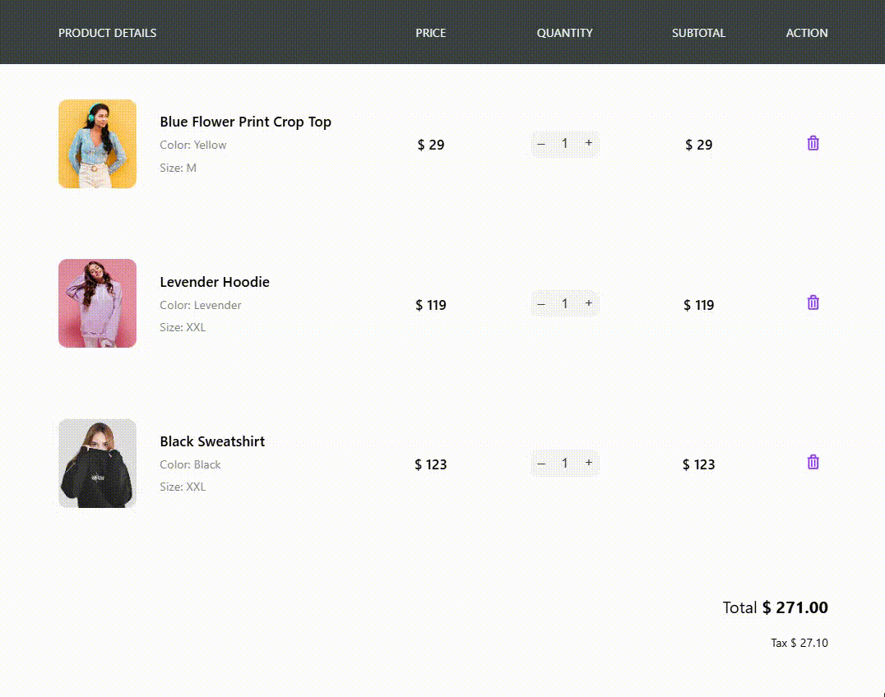

# Корзина покупок (Basket)

Приложение корзины покупок на Vue 3 с Vite для inz демонстрации управлением товарами, количеством и расчетом итоговой суммы.



## ✨ Возможности

- **Просмотр корзины**: Отображение списка товаров с изображениями, названием, цветом, размером и ценой.
- **Управление количеством**: Кнопки для увеличения и уменьшения количества товаров.
- **Удаление товаров**: Возможность удалить товар из корзины.
- **Расчет итогов**: Автоматический расчет общей стоимости и налога.
- **Локальное хранение**: Сохранение состояния корзины в localStorage броузера.

## 🛠 Технологии

- **Vue 3**: Фреймворк для создания пользовательского интерфейса
- **Vite**: Быстрый инструмент сборки
- **JavaScript**: Основной язык программирования
- **CSS/SCSS**: Стилизация компонентов
- **localStorage**: Для сохранения данных броузера

## 📁 Структура проекта

```
basket/
├── public/
│   └── assets/          # Изображения товаров
├── src/
│   ├── components/      # Vue компоненты
│   │   ├── BasketTable.vue         # Основная таблица корзины
│   │   ├── BasketTableItem.vue     # Элемент товара в корзине
│   │   └── BasketTableSummary.vue  # Итоги корзины
│   ├── App.vue          # Главный компонент просмотра
│   └── main.js          # Точка входа браузер
├── babel.config.js
├── package.json
├── vite.config.js
└── README.md           # Этот файл
```

## 🚀 Дистрибуция

### Установка зависимостей

```sh
npm install
```

### Запуск в режиме разработки

```sh
npm run dev
```

### Сборка для продакшена

```sh
npm run build
```

### Превью сборки

```sh
npm run preview
```

### Линтинг и форматирование

```sh
npm run lint
npm run format
```

## 🎨 Дизайн

Приложение имеет clean и современный дизайн с:
- Отзывчивыми компонентами
- Четкой типографией
- Интуитивно понятным интерфейсом управления количеством
- Гибкой таблицей товаров

## 📄 Лицензия

Этот проект является демонстрационным приложением для образовательных целей.
