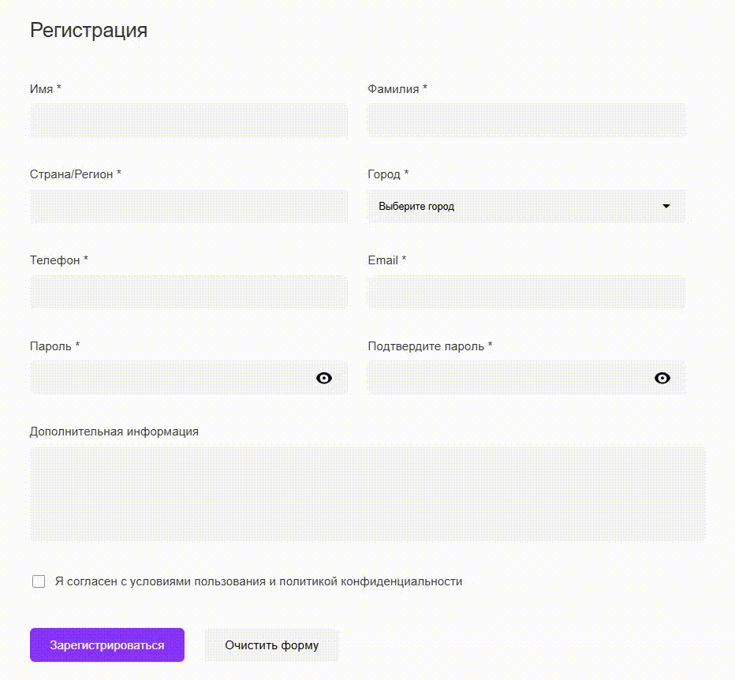

# Форма Регистрации

Демо приложения формы регистрации пользователя с валидацией полей и функционалом переключения видимости паролей.



## Функции

- Полная валидация формы с использованием VeeValidate и Yup
- Переключение видимости пароля и подтверждения пароля
- Валидация телефона с регулярным выражением для российских номеров
- Обязательные поля, включая чекбокс согласия
- Сообщения об ошибках для каждого поля
- Демонстрация успешной регистрации после отправки
- Код разделен на модули для лучшей читаемости (src/validationSchema.js, src/constants.js)

## Recommended IDE Setup

[VSCode](https://code.visualstudio.com/) + [Volar](https://marketplace.visualstudio.com/items?itemName=Vue.volar) (and disable Vetur).

## Customize configuration

See [Vite Configuration Reference](https://vite.dev/config/).

## Project Setup

```sh
npm install
```

### Compile and Hot-Reload for Development

```sh
npm run dev
```

### Compile and Minify for Production

```sh
npm run build
```

### Lint with [ESLint](https://eslint.org/)

```sh
npm run lint
```
