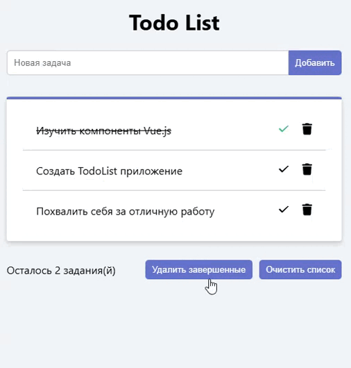

# To-Do List App

Приложение для управления списком задач, разработанное с использованием Vue 3, Composition API и Vite.

## Функции

- **Добавление задач**: Введите текст в поле и нажмите "Добавить" или Enter.
- **Отметка завершения**: Кликните на задачу для переключения статуса.
- **Удаление задач**: Используйте кнопку "Удалить" у каждой задачи.
- **Очистка списка**: Удалите все завершенные или все задачи одним кликом.
- **Счетчик оставшихся задач**: Отображает количество незавершенных задач.

## Ключевые технологии

- Vue 3 Composition API
- Использование `defineModel()` для двусторонней привязки данных в компоненте TodoForm
- Реактивные данные с `reactive` и `ref`
- События между компонентами через `defineEmits()`

 

## Настройка IDE

Рекомендуется использовать [VSCode](https://code.visualstudio.com/) с расширением [Volar](https://marketplace.visualstudio.com/items?itemName=Vue.volar) (отключите Vetur, если установлен).

## Структура проекта

- `App.vue`: Главный компонент, содержащий все задачи и управление ими.
- `TodoForm.vue`: Компонент формы для добавления новых задач с использованием `defineModel()` для двусторонней привязки.
- `TodoListitem.vue`: Компонент для отображения отдельной задачи с кнопками удаления и переключения статуса.

## Настройка проекта

```sh
npm install
```

### Скрипты

- `npm run dev` - Запуск в режиме разработки с горячей перезагрузкой (откройте [http://localhost:5173](http://localhost:5173))
- `npm run build` - Сборка для продакшена
- `npm run lint` - Проверка кода с [ESLint](https://eslint.org/)

Для дополнительной настройки см. [Документацию Vite](https://vite.dev/config/).
